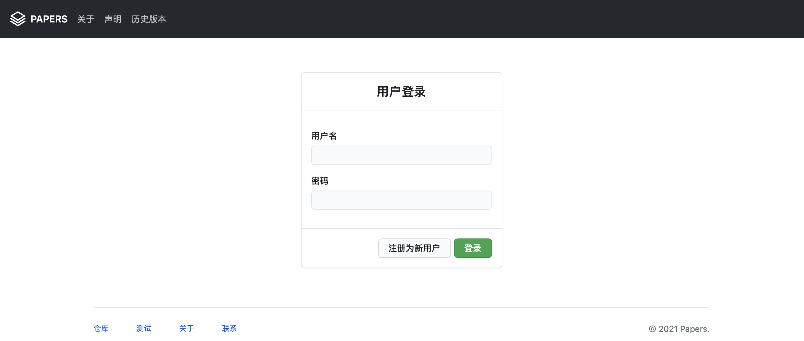
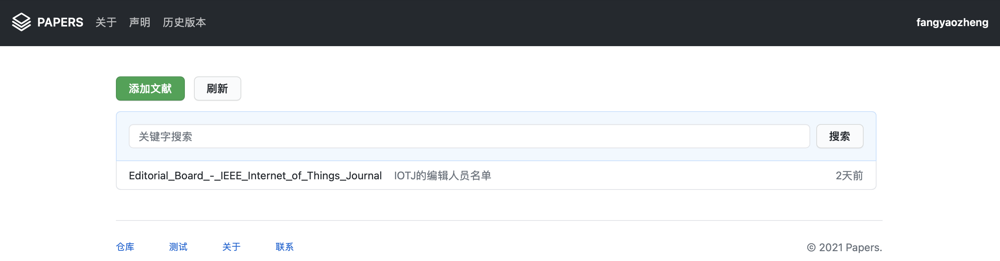

# Papers

Papers is an open-source and flask-based reference manager. Papers's address is [@realfyz/papers](https://github.com/realfyz/papers/).
## Papers looks like...





## Self-hosted

Download the source code by:

```shell
git clone https://github.com/realfyz/papers.git
```

then:

```shell
cd papers/src/
python3 main.py
```

Papers will run on [http://0.0.0.0:80](http://0.0.0.0:80) or [http://127.0.0.1:80](http://127.0.0.1:80).

Besides, some deps is required：

```shell
pip3 install timeago
pip3 install flask
pip3 install Flask-Markdown
```

## What can Papers do?

### Basic
  - 登陆
  - 注册
  - Sessions
  - 基于Sqlite3的持久化存储
  - Pdf Parser (开发中)
  - 验证码 (开发中)
  - 个人资料 (开发中)
### Core
  - 文献在线浏览
  - 文献添加
  - 文献资料修改（开发中）
  - 文献删除
### Others
  - 关于
  - 电影资源
  - 关键字搜索（开发中）

## Design

Papers基于B/S架构，提供轻量级部署和数据浏览。它的组件都是基于开源的框架或扩展。

### A. Frontend

- Primer CSS [@primer/css](https://github.com/primer/css)

### B. Backend

#### Flask Extendeds

- Flask @Flask
- Sqlite3
- Pdfplug
- Timeago @timeago
- Flask-Markdown [@flask-markdown](https://pythonhosted.org/Flask-Markdown/)

#### Database Design


## Bugs

- Chinese is not supported in filename.
